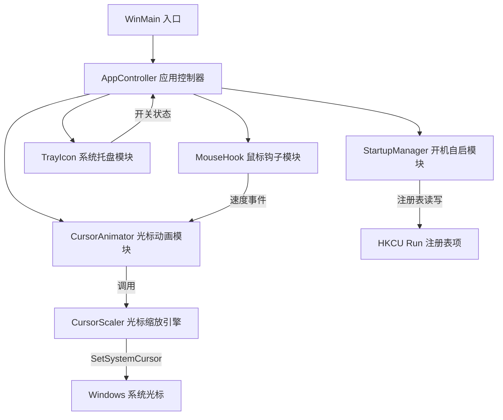
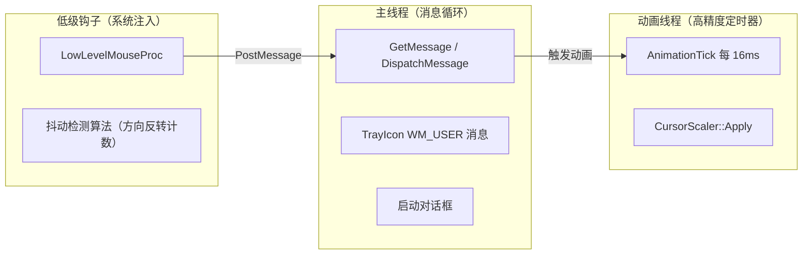
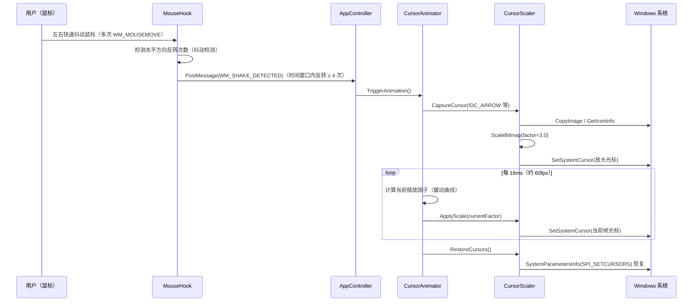
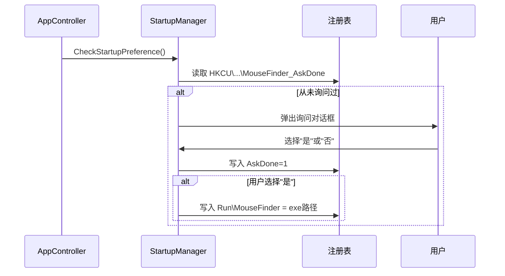

# 设计文档：Mouse Finder（鼠标定位工具）

## 概述

Mouse Finder 是一款 Windows 后台工具，模拟 macOS 的"摇动鼠标放大光标"特性。当用户在短时间内左右快速抖动鼠标四次（水平方向连续反转 4 次）时，系统光标会瞬间放大到原来的 3 倍，然后在约 1 秒内平滑缩小恢复原始大小，帮助用户在多显示器或高分辨率屏幕上快速定位鼠标位置。程序以单个 `.exe` 文件分发，常驻系统托盘，内存占用目标 < 15MB。

该工具使用 Windows API `SetSystemCursor` 实现光标替换，通过全局鼠标钩子（`WH_MOUSE_LL`）监听鼠标水平方向反转次数，在指定时间窗口内检测到 4 次方向反转即触发放大，无需用户安装任何依赖，兼容 Windows 10 / Windows 11。

## 架构

### 整体模块划分



### 进程与线程模型



---

## 高层设计

### 系统序列图：触发与动画完整流程



### 系统序列图：开机自启询问流程



### 组件与接口

#### AppController — 应用控制器

**职责**：
- 程序入口，初始化所有模块
- 持有全局启用/禁用状态
- 处理托盘发来的开关消息
- 运行主消息循环

**接口**：
```cpp
class AppController {
public:
    bool Initialize(HINSTANCE hInstance);
    void Run();          // 消息循环，阻塞直到退出
    void Shutdown();
    void SetEnabled(bool enabled);
    bool IsEnabled() const;
private:
    MouseHook      m_hook;
    CursorAnimator m_animator;
    TrayIcon       m_tray;
    StartupManager m_startup;
    bool           m_enabled = true;
};
```

---

#### MouseHook — 鼠标钩子模块

**职责**：
- 安装 / 卸载 `WH_MOUSE_LL` 全局钩子
- 记录鼠标水平移动方向，检测方向反转次数（抖动检测）
- 在 `SHAKE_WINDOW_MS` 时间窗口内累计反转次数达到 `SHAKE_COUNT` 时向主窗口 PostMessage

**接口**：
```cpp
class MouseHook {
public:
    bool Install(HWND notifyWnd);
    void Uninstall();
    void SetEnabled(bool enabled);
private:
    static LRESULT CALLBACK LowLevelMouseProc(int nCode, WPARAM wParam, LPARAM lParam);
    static MouseHook* s_instance;   // 钩子回调需要静态访问
    HHOOK  m_hook    = nullptr;
    HWND   m_notify  = nullptr;
    bool   m_enabled = true;
    // 抖动检测状态
    int    m_lastX          = 0;     // 上一次鼠标 X 坐标
    int    m_lastDir        = 0;     // 上一次水平方向（+1 向右，-1 向左，0 未初始化）
    int    m_reversalCount  = 0;     // 当前时间窗口内的方向反转次数
    DWORD  m_windowStart    = 0;     // 时间窗口起始时间戳（ms）
};
```

---

#### CursorAnimator — 光标动画模块

**职责**：
- 管理动画状态机（IDLE / ENLARGING / SHRINKING）
- 维护高精度动画定时器（`timeSetEvent` 或 `CreateTimerQueueTimer`）
- 驱动 CursorScaler 应用每帧缩放

**接口**：
```cpp
class CursorAnimator {
public:
    void Initialize(CursorScaler* scaler);
    void TriggerAnimation();          // 可重入：若已在动画中则重置到峰值
    void Tick();                      // 定时器回调，每 ~16ms 调用一次
    bool IsAnimating() const;
private:
    enum class State { IDLE, ENLARGING, SHRINKING };
    State         m_state       = State::IDLE;
    float         m_factor      = 1.0f;   // 当前缩放因子 [1.0, 3.0]
    DWORD         m_startTime   = 0;
    CursorScaler* m_scaler      = nullptr;
    HANDLE        m_timer       = nullptr;

    // 缓动函数：factor = f(elapsedMs, state)
    static float EaseOut(float t);   // t ∈ [0,1] → [0,1]，缓出曲线
};
```

---

#### CursorScaler — 光标缩放引擎

**职责**：
- 捕获当前系统光标的原始位图（含 AND mask 和 XOR mask，或 ARGB 位图）
- 用 GDI 将位图缩放到目标尺寸
- 调用 `SetSystemCursor` 替换系统光标
- 提供 `RestoreCursors()` 恢复系统默认光标

**接口**：
```cpp
class CursorScaler {
public:
    bool CaptureCurrentCursors();            // 程序启动时快照所有标准光标
    void ApplyScale(float factor);           // 替换系统光标为缩放版本
    void RestoreCursors();                   // 还原系统光标
private:
    struct CursorEntry {
        DWORD  cursorId;     // OCR_NORMAL, OCR_IBEAM, etc.
        HCURSOR original;    // 原始光标句柄（CopyImage 副本）
    };
    std::vector<CursorEntry> m_cursors;

    HCURSOR ScaleCursor(HCURSOR src, float factor);
    // 内部：GetIconInfo → StretchBlt → CreateIconIndirect → SetSystemCursor
};
```

---

#### TrayIcon — 系统托盘模块

**职责**：
- 创建托盘图标，注册 `WM_USER+1` 消息回调
- 右键菜单：「暂停 / 恢复」「退出」
- 动态更新托盘提示文字（已启用 / 已暂停）

**接口**：
```cpp
class TrayIcon {
public:
    bool Create(HWND hostWnd, HINSTANCE hInst);
    void Destroy();
    void UpdateState(bool enabled);     // 切换图标与提示文字
private:
    NOTIFYICONDATA m_nid  = {};
    HWND           m_hwnd = nullptr;
    HMENU          m_menu = nullptr;
};
```

---

#### StartupManager — 开机自启模块

**职责**：
- 读写 `HKCU\Software\Microsoft\Windows\CurrentVersion\Run`
- 记录是否已询问过（`HKCU\Software\MouseFinder\AskDone`）
- 提供简单询问对话框（Win32 MessageBox）

**接口**：
```cpp
class StartupManager {
public:
    void CheckAndPrompt(HWND parent);   // 若未询问过则弹框
    bool IsRegistered() const;
    void SetRegistered(bool enable);
private:
    static constexpr wchar_t REG_RUN[]  = LR"(Software\Microsoft\Windows\CurrentVersion\Run)";
    static constexpr wchar_t REG_CFG[]  = LR"(Software\MouseFinder)";
    static constexpr wchar_t VALUE_NAME[] = L"MouseFinder";
    static constexpr wchar_t ASK_DONE[]   = L"AskDone";
};
```

---

## 数据模型

### 抖动检测采样点

```cpp
struct MouseSample {
    POINT pos;       // 屏幕坐标（像素）
    DWORD timestamp; // GetTickCount() 毫秒
};
```

### 动画配置常量（编译期固定，无需用户配置）

```cpp
namespace Config {
    // 抖动检测参数
    constexpr int    SHAKE_COUNT        = 4;     // 触发所需的水平方向反转次数
    constexpr DWORD  SHAKE_WINDOW_MS    = 1000;  // 检测时间窗口（ms），窗口内完成 SHAKE_COUNT 次反转即触发
    constexpr int    MIN_MOVE_PIXELS    = 10;    // 单次移动最小像素数，过滤抖动噪声

    // 动画参数
    constexpr float  MAX_SCALE_FACTOR   = 3.0f;   // 峰值放大倍数
    constexpr DWORD  ANIMATION_DURATION = 1000;   // 总动画时长（ms）
    constexpr DWORD  ENLARGE_DURATION   = 0;      // 瞬间放大（ms）
    constexpr DWORD  SHRINK_DURATION    = 1000;   // 缩小时长（ms）
    constexpr DWORD  TIMER_INTERVAL     = 16;     // 定时器间隔（ms，约60fps）
}
```

---

## 低层设计

### 抖动检测算法

```cpp
// 方向反转计数算法
// 在 LowLevelMouseProc 中每次收到 WM_MOUSEMOVE 时调用
// 前置条件：pos 为当前鼠标屏幕坐标，now 为当前时间戳（ms）
// 后置条件：若时间窗口内累计方向反转次数 >= SHAKE_COUNT，返回 true（触发抖动）

bool MouseHook::CheckShake(POINT pos, DWORD now) {
    int dx = pos.x - m_lastX;

    // 移动量不足，忽略（过滤微小抖动噪声）
    if (abs(dx) < Config::MIN_MOVE_PIXELS) return false;

    int curDir = (dx > 0) ? 1 : -1;

    // 时间窗口超时：重置检测状态
    if (now - m_windowStart > Config::SHAKE_WINDOW_MS) {
        m_reversalCount = 0;
        m_windowStart   = now;
        m_lastDir       = curDir;
        m_lastX         = pos.x;
        return false;
    }

    // 检测方向反转
    if (m_lastDir != 0 && curDir != m_lastDir) {
        ++m_reversalCount;

        if (m_reversalCount >= Config::SHAKE_COUNT) {
            // 触发抖动检测，重置状态防止连续触发
            m_reversalCount = 0;
            m_windowStart   = now;
            m_lastDir       = curDir;
            m_lastX         = pos.x;
            return true;   // 通知调用方 PostMessage(WM_SHAKE_DETECTED)
        }
    }

    m_lastDir = curDir;
    m_lastX   = pos.x;
    return false;
}
```

**循环不变量**：`m_reversalCount` 始终表示当前时间窗口（`[m_windowStart, m_windowStart + SHAKE_WINDOW_MS]`）内已检测到的有效方向反转次数，窗口超时时归零。

---

### 光标缩放算法

```cpp
// 输入：原始 HCURSOR，缩放因子 factor（1.0 ~ 3.0）
// 输出：新的 HCURSOR（调用方负责 DestroyCursor）
// 前置条件：src != NULL，factor > 0
// 后置条件：返回的 HCURSOR 尺寸为 原始尺寸 * factor，热点坐标等比缩放

HCURSOR CursorScaler::ScaleCursor(HCURSOR src, float factor) {
    ICONINFO ii = {};
    GetIconInfo(src, &ii);

    // 获取原始尺寸
    BITMAP bm = {};
    GetObject(ii.hbmMask, sizeof(bm), &bm);
    int origW = bm.bmWidth;
    int origH = (ii.hbmColor != NULL) ? bm.bmHeight : bm.bmHeight / 2;

    int newW = (int)(origW * factor);
    int newH = (int)(origH * factor);

    // 缩放 Color 位图（若存在，即彩色光标）
    HBITMAP hNewColor = NULL;
    if (ii.hbmColor) {
        HDC hdcSrc = CreateCompatibleDC(NULL);
        HDC hdcDst = CreateCompatibleDC(NULL);
        hNewColor  = CreateCompatibleBitmap(hdcSrc, newW, newH);
        SelectObject(hdcSrc, ii.hbmColor);
        SelectObject(hdcDst, hNewColor);
        SetStretchBltMode(hdcDst, HALFTONE);
        StretchBlt(hdcDst, 0, 0, newW, newH,
                   hdcSrc, 0, 0, origW, origH, SRCCOPY);
        DeleteDC(hdcSrc);
        DeleteDC(hdcDst);
    }

    // 缩放 Mask 位图（AND mask）
    HDC hdcSrc = CreateCompatibleDC(NULL);
    HDC hdcDst = CreateCompatibleDC(NULL);
    int maskH  = ii.hbmColor ? origH : origH * 2;  // 单色光标 mask 高度是两倍
    int newMaskH = ii.hbmColor ? newH : newH * 2;
    HBITMAP hNewMask = CreateBitmap(newW, newMaskH, 1, 1, NULL);
    SelectObject(hdcSrc, ii.hbmMask);
    SelectObject(hdcDst, hNewMask);
    SetStretchBltMode(hdcDst, BLACKONWHITE);
    StretchBlt(hdcDst, 0, 0, newW, newMaskH,
               hdcSrc, 0, 0, origW, maskH, SRCCOPY);
    DeleteDC(hdcSrc);
    DeleteDC(hdcDst);

    // 重建 ICONINFO，热点坐标等比缩放
    ICONINFO newII    = {};
    newII.fIcon       = FALSE;   // 这是光标（不是图标）
    newII.xHotspot    = (DWORD)(ii.xHotspot * factor);
    newII.yHotspot    = (DWORD)(ii.yHotspot * factor);
    newII.hbmMask     = hNewMask;
    newII.hbmColor    = hNewColor;

    HCURSOR result = (HCURSOR)CreateIconIndirect(&newII);

    // 清理临时资源
    DeleteObject(ii.hbmMask);
    DeleteObject(ii.hbmColor);
    DeleteObject(hNewMask);
    if (hNewColor) DeleteObject(hNewColor);

    return result;
}
```

---

### 动画缓动函数（缓出二次方）

```cpp
// 输入：t ∈ [0.0, 1.0]（归一化动画进度）
// 输出：factor ∈ [1.0, MAX_SCALE_FACTOR]
// 描述：从峰值 3.0 平滑缓出到 1.0，加速度递减

float CursorAnimator::EaseOut(float t) {
    // ease-out quadratic: f(t) = 1 - (1-t)^2
    float eased = 1.0f - (1.0f - t) * (1.0f - t);
    // 从 MAX_SCALE_FACTOR 插值到 1.0
    return Config::MAX_SCALE_FACTOR - eased * (Config::MAX_SCALE_FACTOR - 1.0f);
}

void CursorAnimator::Tick() {
    if (m_state == State::IDLE) return;

    DWORD elapsed = GetTickCount() - m_startTime;
    float t = (float)elapsed / (float)Config::SHRINK_DURATION;

    if (t >= 1.0f) {
        m_factor = 1.0f;
        m_state  = State::IDLE;
        m_scaler->RestoreCursors();
        return;
    }

    m_factor = EaseOut(t);
    m_scaler->ApplyScale(m_factor);
}

void CursorAnimator::TriggerAnimation() {
    // 可重入：若已在动画中，重置到峰值重新开始缩小
    m_startTime = GetTickCount();
    m_factor    = Config::MAX_SCALE_FACTOR;
    m_state     = State::SHRINKING;
    m_scaler->ApplyScale(m_factor);   // 立即应用峰值（瞬间放大）
}
```

---

### 主消息循环与模块初始化

```cpp
// WinMain 入口
// 前置条件：Windows 10 或更高版本
// 后置条件：所有模块正确初始化，消息循环退出后资源全部释放

int WINAPI wWinMain(HINSTANCE hInst, HINSTANCE, PWSTR, int) {
    // 防止重复启动：命名互斥量
    HANDLE hMutex = CreateMutexW(NULL, TRUE, L"MouseFinder_SingleInstance");
    if (GetLastError() == ERROR_ALREADY_EXISTS) {
        CloseHandle(hMutex);
        return 0;
    }

    AppController app;
    if (!app.Initialize(hInst)) {
        MessageBoxW(NULL, L"初始化失败", L"MouseFinder", MB_ICONERROR);
        return 1;
    }

    app.Run();   // 阻塞，直到用户选择"退出"

    CloseHandle(hMutex);
    return 0;
}
```

---

## 错误处理

### 错误场景 1：`SetSystemCursor` 失败

**条件**：高 DPI 或受保护桌面（如 UAC 提示界面）下，`SetSystemCursor` 返回 FALSE。  
**处理**：静默忽略本次帧，不影响后续动画。记录到调试输出（`OutputDebugString`）。  
**恢复**：动画结束后正常调用 `RestoreCursors`，系统光标自动恢复。

### 错误场景 2：钩子安装失败

**条件**：`SetWindowsHookEx` 返回 NULL（权限不足或系统限制）。  
**处理**：显示 MessageBox 提示用户，程序正常启动但功能不可用，托盘图标显示"已禁用（钩子安装失败）"。

### 错误场景 3：注册表操作失败

**条件**：`RegOpenKeyEx` / `RegSetValueEx` 返回非 ERROR_SUCCESS。  
**处理**：静默忽略，开机自启功能不可用，不影响程序主功能。

### 错误场景 4：光标捕获返回空句柄

**条件**：`GetCursor()` 返回 NULL 或 `GetIconInfo` 失败（某些自定义光标）。  
**处理**：跳过该光标类型的缩放，保持原光标不变。

---

## 测试策略

### 单元测试重点

- `CheckShake`：验证各种抖动场景（未达到次数、恰好达到次数、窗口超时重置、噪声过滤）
- `EaseOut`：验证 t=0 时返回 MAX_SCALE_FACTOR，t=1 时返回 1.0，中间值单调递减
- `StartupManager`：Mock 注册表读写，验证询问逻辑的状态转换

### 基于属性的测试

**抖动检测属性**：
- 水平移动方向反转次数不足 `SHAKE_COUNT` 时，`CheckShake` 不触发
- 在 `SHAKE_WINDOW_MS` 时间窗口内方向反转恰好 `SHAKE_COUNT` 次，触发且仅触发一次
- 超过 `SHAKE_WINDOW_MS` 后的反转次数不计入当前窗口（窗口重置）
- 单次移动量 < `MIN_MOVE_PIXELS` 的事件不增加反转计数（噪声过滤）
- 触发后 `m_reversalCount` 归零，不连续触发

**缓动函数属性**：
- `∀ t ∈ [0,1]: EaseOut(t) ∈ [1.0, MAX_SCALE_FACTOR]`
- `EaseOut` 在 [0,1] 上单调不增
- `EaseOut(0) == MAX_SCALE_FACTOR`，`EaseOut(1) == 1.0`

### 集成测试重点

- 触发流程：模拟左右快速抖动鼠标消息（方向反转 4 次，间隔 < SHAKE_WINDOW_MS）→ 验证 `SetSystemCursor` 被调用
- 动画恢复：动画完成后系统光标恢复为原始光标
- 托盘开关：禁用状态下抖动鼠标不触发放大
- 抖动超时：反转 3 次后超过 SHAKE_WINDOW_MS，再反转 1 次不应触发（已重置）

---

## 性能与内存考量

| 模块 | 内存预估 | 备注 |
|------|----------|------|
| 可执行文件本体 | ~200KB | 纯 Win32 C++，无 CRT 动态库（静态链接） |
| 缓存的缩放光标 | ~2MB | 约 20 种标准光标，每种 3x 版本缓存 |
| GDI 对象 | ~1MB | 动画中临时 HDC/HBITMAP，帧结束即释放 |
| 工作集总计 | ~5MB | 远低于 15MB 目标 |

- 低级鼠标钩子回调须在 **主线程消息循环**所在线程安装，回调本身应极快（< 1ms），避免系统卡顿。
- 动画定时器使用 `CreateTimerQueueTimer` 而非 `SetTimer`，精度更高（16ms 而非 55ms）。
- 光标缩放结果**不做缓存**（每次 ApplyScale 实时生成），避免为每个 factor 值预存大量 HCURSOR，节省内存；缩放开销约 0.1~0.5ms，在动画线程中可接受。

---

## 安全考量

- 程序以**普通用户权限**运行，无需管理员权限（`WH_MOUSE_LL` 不需要提权）。
- 注册表写入范围限定在 `HKCU`（当前用户），不修改 `HKLM`。
- 单实例互斥量防止多次启动导致重复钩子。
- 不联网，不收集任何数据。

---

## 依赖

| 依赖 | 类型 | 说明 |
|------|------|------|
| Windows 10 SDK | 编译期 | `SetSystemCursor`、`WH_MOUSE_LL`、`NOTIFYICONDATA` |
| GDI (gdi32.lib) | 静态链接 | 位图缩放 |
| User32 (user32.lib) | 静态链接 | 钩子、光标 API、消息循环 |
| Shell32 (shell32.lib) | 静态链接 | 托盘图标 `Shell_NotifyIcon` |
| Winmm (winmm.lib) | 静态链接 | 高精度定时器（可选，备选方案为 `CreateTimerQueueTimer`） |
| MSVC 或 MinGW | 编译器 | 建议用 MSVC 静态链接 `/MT`，生成单文件 |

无第三方库依赖，所有功能均通过 Win32 API 实现。

---

## 正确性属性

*属性是在所有有效执行中都应成立的行为特征——本质上是关于系统应做什么的正式陈述。属性是人类可读规范与机器可验证正确性保证之间的桥梁。*

### 属性 1：噪声过滤不改变计数

*对于任意* 由位移量均小于 `MIN_MOVE_PIXELS`（10px）的鼠标移动事件组成的序列，调用 `CheckShake` 后，方向反转计数应保持不变，且不触发抖动信号。

**验证：需求 1.5**

---

### 属性 2：有效抖动序列精确触发且归零

*对于任意* 在 `SHAKE_WINDOW_MS`（1000ms）时间窗口内，由恰好 `SHAKE_COUNT`（4）次有效方向反转（每次位移 ≥ `MIN_MOVE_PIXELS`）构成的输入序列，`CheckShake` 应在第 4 次反转时返回 true 且仅返回一次，并将 `m_reversalCount` 归零，后续相同操作不会在未重新积累的情况下再次触发。

**验证：需求 1.3, 1.7**

---

### 属性 3：时间窗口超时重置

*对于任意* 部分抖动序列（已积累 1 至 `SHAKE_COUNT-1` 次反转），若后续输入与最后一次有效移动之间的时间间隔超过 `SHAKE_WINDOW_MS`，则再次开始积累反转次数时应从零重新计数，达到 `SHAKE_COUNT` 次才触发，不会将超时前的计数与超时后的计数相加。

**验证：需求 1.4**

---

### 属性 4：禁用状态下抖动不触发

*对于任意* 满足触发条件的有效抖动手势序列，当 MouseHook 处于禁用状态（`SetEnabled(false)`）时，`CheckShake` 不应发出抖动检测信号，方向反转计数保持为零。

**验证：需求 1.6**

---

### 属性 5：动画可重入性——再触发重置到峰值

*对于任意* 动画进行中的时刻（`CursorAnimator` 状态为 `SHRINKING`，当前 factor 处于任意值），再次调用 `TriggerAnimation()` 后，当前缩放因子应立即被设置为 `MAX_SCALE_FACTOR`（3.0），动画计时器重新从该时刻开始计算，缩小过程重新开始。

**验证：需求 2.5**

---

### 属性 6：光标缩放尺寸与热点正确性

*对于任意* 原始光标（包括彩色 Color+Mask 光标和单色 Mask-only 光标）以及任意缩放因子 `factor ∈ (1.0, MAX_SCALE_FACTOR]`，`ScaleCursor(src, factor)` 返回的光标应满足：输出宽度为 `⌊origW × factor⌋`，输出高度为 `⌊origH × factor⌋`，热点坐标为 `(⌊xHotspot × factor⌋, ⌊yHotspot × factor⌋)`，且 Color 位图（若存在）和 AND Mask 位图均被正确缩放。

**验证：需求 3.2, 3.3, 3.4, 8.1, 8.2**

---

### 属性 7：光标缩放-恢复 round-trip

*对于任意* 已捕获原始光标的 `CursorScaler` 实例，在任意缩放因子 `factor` 下调用 `ApplyScale(factor)` 之后，再调用 `RestoreCursors()`，系统光标应恢复到调用 `ApplyScale` 之前的原始状态，与未调用 `ApplyScale` 时的状态等价。

**验证：需求 3.5**

---

### 属性 8：缓动函数值域约束

*对于任意* 归一化动画进度 `t ∈ [0.0, 1.0]`，`CursorAnimator::EaseOut(t)` 的返回值应始终位于区间 `[1.0, MAX_SCALE_FACTOR]`（即 `[1.0, 3.0]`）内。

**验证：需求 8.3**

---

### 属性 9：缓动函数单调性

*对于任意* 两个归一化进度值 `t1, t2 ∈ [0.0, 1.0]`，若 `t1 < t2`，则 `EaseOut(t1) ≥ EaseOut(t2)`——即光标缩放因子随动画进度单调不增，不出现反弹放大的情况。

**验证：需求 8.5**

---

### 属性 10：托盘启用/禁用状态一致性

*对于任意* 初始启用状态（`enabled = true` 或 `false`），通过托盘菜单触发「暂停」或「恢复」操作后，`AppController::IsEnabled()` 的返回值、托盘图标提示文字以及 `MouseHook` 的禁用状态应三者保持一致，且与用户操作的预期结果相符（原来启用则变禁用，原来禁用则变启用）。

**验证：需求 4.3, 4.4, 4.5, 4.6**
